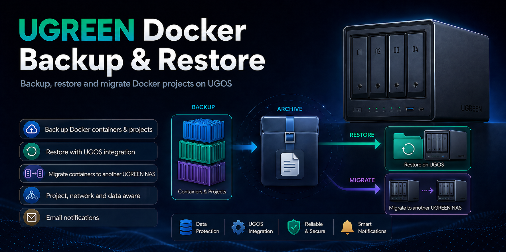

# 🚀 UGREEN NAS Docker Backup & Restore



## 📦 Überblick

Dieses Projekt stellt ein leistungsstarkes Backup-, Restore- und Migrationssystem für Docker-Projekte auf UGREEN NAS mit UGOS bereit.

✔ Backup von Docker-Containern und Projekten
✔ Restore mit UGOS-Docker-App-Integration
✔ Migration auf ein anderes UGREEN NAS
✔ Unterstützung für Standalone-Container
✔ Optionale SCP-Remote-Sicherung
✔ Pfad-Remapping für NAS-Umzüge
✔ E-Mail-Benachrichtigungen
✔ Cronjob-Unterstützung
✔ Shutdown Unterstützung nach Abschluss
✔ Deutsch & Englisch

* * *

## 📁 Repository Struktur

```text
v1.00/
├── DockerBackup/
│   ├── backup-exclude-paths.txt
│   ├── dockersich.env.example
│   ├── path-remap.tsv
│   ├── ugreen-docker-backup.sh
│   └── ugreen-docker-restore.sh
│
├── Screen/
│   └── DockerBackupPack.png
│
├── README.md
├── CHANGELOG.md
└── UGREEN_Docker_BR_DE_EN.pdf
```

* * *

## ⚙️ Installation

### 1. Freigabe in UGOS anlegen

Lege in der UGOS-App **Dateien** eine Freigabe mit dem Namen **DockerBackup** an.

Beispiel:

```text
/volume2/DockerBackup
```

Hinweise:
- Papierkorb für diese Freigabe deaktiviert lassen
- Prüfen, dass Administratoren Lese- und Schreibrechte haben
- Das Volume kann auch ein anderes sein, zum Beispiel `/volume1` oder `/volume3`

* * *

### 2. Dateien kopieren

Kopiere den Inhalt aus:

```text
DockerBackup/
```

nach:

```text
/volume2/DockerBackup
```

* * *

### 3. Rechte setzen

```bash
cd /volume2/DockerBackup
cp dockersich.env.example dockersich.env
chmod +x ugreen-docker-backup.sh ugreen-docker-restore.sh
```

* * *

### 4. Konfiguration anpassen

Datei:

```text
/volume2/DockerBackup/dockersich.env
```

Für den ersten Test sollten Einsteiger vor allem diese Werte prüfen:

```bash
LANGUAGE=de
HOST_LABEL="UGREEN NAS"
SOURCE_DIR=auto
BACKUP_DIR=/volume2/DockerBackup
SEND_MAIL=false
DRY_RUN=true
```

Wichtige Hinweise:
- `SOURCE_DIR=auto` erkennt den Docker-Projektordner automatisch
- `DOCKER_ROOT_DIR=auto` erkennt das Docker-Datenverzeichnis automatisch
- `UGOS_DOCKER_DB=auto` erkennt die UGOS-Docker-Datenbank automatisch
- `DRY_RUN=true` ist für den ersten Restore-Test empfehlenswert

* * *

## 🗂️ Wichtige Optionen

### Basis und Pfade

- `LANGUAGE` = Sprache für Ausgaben, Logs und Mails (`de` oder `en`)
- `HOST_LABEL` = Anzeigename des NAS in Logs und Mails
- `SOURCE_DIR` = Docker-Projektordner, meist automatisch erkannt
- `BACKUP_DIR` = Zielordner für Archive, Logs und temporäre Dateien
- `TEMP_DIR` = temporärer Arbeitsordner
- `LOG_DIR` = Ordner für Backup- und Restore-Logs

### Backup-Verhalten

- `BACKUP_ALL_PROJECTS=true` = alle erkannten Docker-Projekte sichern
- `INCLUDE_PROJECTS` = nur bestimmte Projekte sichern
- `EXCLUDE_PROJECTS` = Projekte vom Backup ausschließen
- `BACKUP_STANDALONE_CONTAINERS=true` = Container ohne Compose-Projekt mit sichern
- `STOP_CONTAINERS=true` = laufende Container vor dem Backup kurz stoppen
- `BACKUP_EXCLUDE_PATHS_FILE=backup-exclude-paths.txt` = Ausschlussliste für große Cache-Ordner

### Zusätzliche Inhalte

- `BACKUP_IMAGES=false` = Docker-Images zusätzlich sichern
- `BACKUP_NAMED_VOLUMES=false` = Named Volumes zusätzlich sichern
- `BACKUP_EXTERNAL_BINDS=false` = externe Bind-Mounts zusätzlich sichern

### Restore-Verhalten

- `DRY_RUN=true` = Restore erst nur simulieren
- `RESTORE_ALL_PROJECTS=false` = gezielter Restore statt alles zurückspielen
- `RESTORE_PROJECTS` = nur bestimmte Projekte wiederherstellen
- `RESTORE_OVERWRITE_EXISTING=false` = vorhandene Zielordner nicht überschreiben
- `RESTORE_STANDALONE_CONTAINERS=true` = Standalone-Container ebenfalls wiederherstellen
- `ENABLE_PATH_REMAP=true` = Pfade beim Umzug auf ein anderes NAS anpassen
- `PATH_REMAP_FILE=path-remap.tsv` = Datei mit Quell- und Zielpfaden
- `UPDATE_UGOS_DOCKER_DB=true` = UGOS-Docker-App-Datenbank aktualisieren
- `REFRESH_UGOS_DOCKER_APP=true` = Docker-App-Dienst nach Restore aktualisieren

### Benachrichtigungen und Remote-Sicherung

- `SEND_MAIL=true|false` = Mailbenachrichtigungen aktivieren oder deaktivieren
- `MAIL_NOTIFY_ON=all|success|fail|none` = wann Mails verschickt werden
- `ENABLE_REMOTE_BACKUP=true|false` = Archiv zusätzlich per SCP auf ein anderes System kopieren
- `REMOTE_HOST`, `REMOTE_USER`, `REMOTE_PORT`, `REMOTE_PATH` = Zielsystem für Remote-Backups

* * *

## 🔄 Backup starten

```bash
cd /volume2/DockerBackup
./ugreen-docker-backup.sh
```

Das Skript:
- erkennt Docker-Pfade automatisch
- wählt die Projekte anhand der Konfiguration aus
- stoppt auf Wunsch laufende Container kurz
- erstellt ein komprimiertes Archiv
- startet zuvor laufende Container wieder
- verschickt optional Statusmails

* * *

## ♻️ Restore starten

Restore immer zuerst mit Dry-Run testen:

```bash
cd /volume2/DockerBackup
./ugreen-docker-restore.sh /volume2/DockerBackup/ugreen-docker-backup_YYYY-MM-DD_HH-MM-SS.tar.gz
```

Für den ersten Test in `dockersich.env`:

```bash
DRY_RUN=true
```

Für einen echten Restore später:

```bash
DRY_RUN=false
```

Danach fragt das Skript zur Sicherheit nach der Eingabe:

```text
RESTORE
```

* * *

## 🔁 Container auf ein anderes UGREEN NAS umziehen

Das Paket eignet sich auch, um Docker-Projekte auf ein anderes UGREEN NAS umzuziehen.

Typischer Ablauf:
1. Backup auf dem Quell-NAS erstellen
2. Archiv auf das Ziel-NAS kopieren
3. Falls nötig `path-remap.tsv` anpassen
4. Restore auf dem Ziel-NAS ausführen
5. UGOS-Docker-App-Abgleich automatisch durchführen lassen

Damit können Projektordner, Compose-Projekte und auf Wunsch weitere Inhalte sauber auf das Zielsystem übernommen werden.

* * *

## 🧩 Standalone-Container

Container ohne Compose-Projektlabel werden auf Wunsch automatisch als eigenes Projekt gesichert.

Beispiel:

```text
ubuntu-1 -> standalone_ubuntu-1
```

Beim Restore wird daraus wieder ein Compose-Projekt erzeugt und in die UGOS-Docker-App integriert.

* * *

## ⏱️ Cronjob einrichten

```bash
crontab -e
```

Beispiel:

```bash
30 3 * * 0 cd /volume2/DockerBackup && /volume2/DockerBackup/ugreen-docker-backup.sh >> /volume2/DockerBackup/cron.log 2>&1
```

➡️ Läuft jeden Sonntag um 03:30 Uhr

* * *

## 📦 Features

- Backup aller oder ausgewählter Docker-Projekte
- Restore einzelner oder mehrerer Projekte
- Migration auf ein anderes UGREEN NAS
- Automatische Erkennung von Docker-Pfaden
- Restore mit UGOS-Docker-App-Abgleich
- Unterstützung für Standalone-Container
- Ausschlusslisten für große Cache-Ordner
- Optionales Backup von Images, Named Volumes und externen Bind-Mounts
- SCP-basierte Remote-Sicherung
- Path-Remapping für abweichende Zielpfade
- E-Mail bei Start, Erfolg und Fehler
- Logging und Cronjob-Betrieb

* * *

## 📘 Handbuch

Enthalten im Repository:

```text
UGREEN_Docker_BR_DE_EN.pdf
UGREEN_Docker_BR_DE_EN.docx
```

Das Handbuch enthält die vollständige Schritt-für-Schritt-Anleitung für Installation, Konfiguration, Backup, Restore und Migration.

* * *

## 🛠️ Troubleshooting

| Problem | Lösung |
|---|---|
| Skript startet nicht | `chmod +x` prüfen |
| Keine Mail | SMTP-Daten und `MAIL_NOTIFY_ON` prüfen |
| Keine Projekte ausgewählt | `BACKUP_ALL_PROJECTS`, `INCLUDE_PROJECTS` und `EXCLUDE_PROJECTS` prüfen |
| Archiv wird sehr groß | `backup-exclude-paths.txt` prüfen und Cache-Pfade ausschließen |
| Restore erscheint nicht in UGOS | `REFRESH_UGOS_DOCKER_APP=true` nutzen oder Projekt in UGOS neu bereitstellen |
| `scp` schlägt fehl | bei manuellen Tests `scp -O` verwenden |

* * *

## ⚠️ Hinweis

Dieses Projekt ist eine Community-Lösung und kein offizielles UGREEN-Produkt.
Verwendung auf eigene Verantwortung.

* * *

## 👨‍💻 Autor

Roman Glos  
UGREEN NAS Community

* * *

## ⭐ Support

Wenn dir das Projekt gefällt:

- Star ⭐ auf GitHub
- Feedback ist willkommen
- Verbesserungsvorschläge und Praxistests helfen dem Projekt weiter
